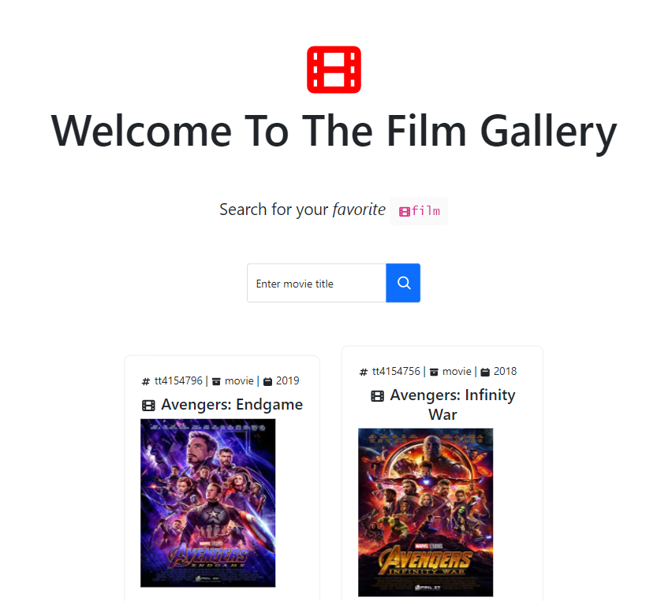

# Film Gallery

> This is a [Next.js](https://nextjs.org/) project bootstrapped with [`create-next-app`](https://github.com/vercel/next.js/tree/canary/packages/create-next-app).

This is a web app that uses the [OMDB API](http://www.omdbapi.com) to serve movie data.

It allow any film searches and renders the results in a nice and simple UI.

## Getting Started

First, you need an API key from OMDB website [link here](http://www.omdbapi.com/apikey.aspx).

Once you have validated the API key then enter command like this in your terminal:

`echo OMDB_API_KEY=[the API key] > .env.local && echo NEXT_PUBLIC_OMDB_API_KEY=[the API key] >> .env.local`

For example; assuming the API key is `1234aBcD` then enter the code below in the terminal:

> Note that we are assuming in the below code that your API key is `1234aBcD` as metioned above. Please replace with your verified API key before starting the development server.

```bash
echo OMDB_API_KEY=1234aBcD > .env.local && echo NEXT_PUBLIC_OMDB_API_KEY=1234aBcD >> .env.local
```

Second, install the dependencies.

Third, run the development server:

```bash
npm run dev
# or
yarn dev
# or
pnpm dev
```

Open [http://localhost:3000](http://localhost:3000) with your browser to see the result. 

You can start editing the page by modifying `pages/index.tsx`. The page auto-updates as you edit the file.

And finally, you can also start the test server:

```bash
npm run test
# or
yarn test
# or
pnpm test
```


## Learn More

To learn more about Next.js, take a look at the following resources:

- [Next.js Documentation](https://nextjs.org/docs) - learn about Next.js features and API.
- [Learn Next.js](https://nextjs.org/learn) - an interactive Next.js tutorial.

## Deploy on Vercel

The easiest way to deploy your Next.js app is to use the [Vercel Platform](https://vercel.com/new?utm_medium=default-template&filter=next.js&utm_source=create-next-app&utm_campaign=create-next-app-readme) from the creators of Next.js.

Check out our [Next.js deployment documentation](https://nextjs.org/docs/deployment) for more details.

> You can check out the live web app [here](https://film-gallery.vercel.app) - your feedback is welcome!
